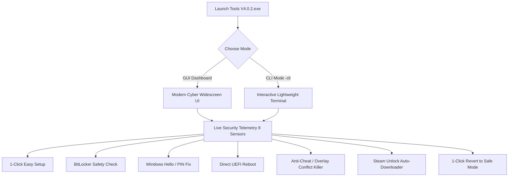

# HV Bypass Tool v4.0.2 (Modernized Edition)

[](https://github.com/)
[-0078d6.svg)](https://microsoft.com/windows)
[]()
[]()

A comprehensive, next-generation Windows virtualization, security, and hypervisor configuration utility. Designed specifically to prepare Windows 10 and Windows 11 systems for custom hypervisors and virtualization bypass frameworks (such as **Steam Unlock ONENNABE / SUO**, **HV-PlugNPlay**, and **HV-Universal**), while preventing login lockouts, BitLocker recovery traps, and system instability.

---

## ⚠️ Critical Disclaimer — Use At Your Own Risk

> [!CAUTION]
> **READ CAREFULLY BEFORE USING THIS SOFTWARE:**
> 
> This tool modifies low-level Windows operating system security parameters, boot configuration data (BCD), kernel code integrity policies, and registry keys (including Virtualization-Based Security, Memory Integrity/HVCI, Driver Signature Enforcement, and Windows Hello policies).
> 
> * **NO WARRANTY OR LIABILITY**: This software is provided **"AS IS"**, without warranty of any kind, express or implied. In no event shall the authors, maintainers, or contributors be held liable for any claim, damages, data loss, operating system corruption, hardware malfunction, blue screen of death (BSOD), or boot failure arising from the use or misuse of this tool.
> * **USE AT YOUR OWN RISK**: You are solely responsible for evaluating the risks and actions taken by this tool on your machine.
> * **BITLOCKER RECOVERY KEY**: If your system drive (`C:`) has BitLocker Drive Encryption enabled, altering BIOS/UEFI settings (such as Secure Boot) can trigger BitLocker recovery mode. **Ensure you have your 48-digit BitLocker Recovery Key backed up** (accessible via your [Microsoft Account Recovery Keys](https://account.microsoft.com/devices/recoverykey)) before modifying BIOS settings. While the tool includes an automated 1-reboot BitLocker suspension feature, having your key saved externally is mandatory.
> * **WINDOWS HELLO / PIN LOCKOUT RISK**: Enrolled Windows Hello PINs and biometric sign-ins are tied to Virtual Secure Mode (VSM). Disabling VBS without disengaging Windows Hello can cause Windows to present: *"Something happened and your PIN isn't available"* upon reboot. **Ensure you know your Microsoft/Local account password** before proceeding.
> * **COMPETITIVE ANTI-CHEAT COMPATIBILITY**: Anti-cheat systems such as **Riot Vanguard (Valorant)** and **Faceit (CS2)** strictly mandate Secure Boot, HVCI, and VBS to be active. Running games with modified kernel security states may cause launch rejections or penalties. Use the built-in **"Revert to Default (Safe Mode)"** function and re-enable Secure Boot before playing competitive anti-cheat games.

---

## 📦 Releases & Downloads

The official compiled binaries and script distributions for version 4.0.2 are available in the repository root:

| Release File | Format | Recommended For | Description |
| :--- | :--- | :--- | :--- |
| 🚀 **[`Tools V4.0.2.exe`](file:///c:/Users/aminu/OneDrive/Documents/GitHub/HV-Tools/Tools%20V4.0.2.exe)** | **Compiled Executable (.exe)** | **General Users (Primary Release)** | Standalone compiled Win32 application. Features automatic UAC administrator self-elevation, zero-flicker console hiding, embedded payload extraction, and full CLI/GUI support. |
| 📄 **[`Tools V4.0.2.bat`](file:///c:/Users/aminu/OneDrive/Documents/GitHub/HV-Tools/Tools%20V4.0.2.bat)** | **Hybrid Batch / PS1 (.bat)** | **Scripting / Portable** | Self-elevating polyglot batch wrapper that dynamically unpacks and executes the PowerShell engine. |
| 📜 **[`Tools V4.0.2.ps1`](file:///c:/Users/aminu/OneDrive/Documents/GitHub/HV-Tools/Tools%20V4.0.2.ps1)** | **PowerShell Script (.ps1)** | **Power Users / Admins** | Pure PowerShell script for direct execution via PowerShell 5.1 / 7 console. |

### How to Run `Tools V4.0.2.exe`

1. Download or locate [`Tools V4.0.2.exe`](file:///c:/Users/aminu/OneDrive/Documents/GitHub/HV-Tools/Tools%20V4.0.2.exe).
2. **Double-click to launch**: The executable will automatically request Windows Administrator (UAC) privileges and open the widescreen Cyber Dark GUI dashboard.
3. **Command Line Interface (CLI) Mode**: To launch directly into the lightweight terminal menu, run:
   ```cmd
   "Tools V4.0.2.exe" -cli
   ```
   *(Flags supported: `-cli`, `--cli`, `/cli`, `-CliOnly`)*

---

## 🔍 What Does This Tool Do?

Modern Windows versions (Windows 10 20H2+ and Windows 11) enforce kernel-level isolation features like **Virtualization-Based Security (VBS)** and **Hypervisor-Enforced Code Integrity (HVCI / Memory Integrity)**. While these features protect against untrusted drivers, they also block third-party hypervisors, custom virtualized game loaders, and driver emulation layers.

Manually toggling these options requires editing multiple registry hives, running cryptic `bcdedit` commands, dealing with greyed-out Windows Settings, and risking catastrophic PIN lockouts.

**HV Bypass Tool v4.0.2** solves all of this in a single, unified utility:



### Core Capabilities & Features

#### 1. ⚡ 1-Click Easy Setup (Recommended)
* **Zero Technical Knowledge Required**: Automatically handles all configuration in the background without freezing the application UI.
* **Creates a System Restore Point**: Takes a safety checkpoint snapshot of system state before touching any configurations.
* **Disables VBS & Memory Integrity (HVCI)**: Configures `DeviceGuard` and `HypervisorEnforcedCodeIntegrity` registry keys and sets `hypervisorlaunchtype off` in BCD.
* **Disengages Windows Hello VBS Policies**: Neutralizes DeviceGuard biometric scenarios and unlocks the PIN removal mechanism to prevent lock-screen failures.
* **Whitelists Working Folder**: Automatically adds the application folder to Windows Defender exclusions so hypervisor drivers are not falsely quarantined.
* **Configures BCD Test Mode**: Enables `testsigning` and disables integrity checks for unsigned driver support.

#### 2. 🛡️ Live Security Telemetry (8 In-Depth Sensors)
The dashboard continuously reads live kernel and system metrics every 4 seconds:
* **Hardware & OS Identification**: Instant registry query of CPU model, motherboard manufacturer, and OS version/architecture.
* **Hardware Virtualization**: Checks BIOS-level virtualization state (AMD SVM / Intel VT-x).
* **Secure Boot Telemetry**: Detects UEFI Secure Boot status.
* **Virtualization-Based Security (VBS)**: Detects whether VBS is active or disengaged.
* **Memory Integrity (HVCI)**: Verifies kernel code integrity status.
* **Live In-Memory Kernel Telemetry**: Utilizes native NT API `NtQuerySystemInformation` (Class 103) to inspect running kernel Code Integrity bits (`CODEINTEGRITY_OPTION_ENABLED`, `CODEINTEGRITY_OPTION_TESTSIGN`, `CODEINTEGRITY_OPTION_HVCI_KMCI_ENABLED`).
* **Windows Hello Conflict Detection**: Detects if your active PIN/biometrics are bound to VBS, warning you *before* you reboot.
* **Conflicting Services & Overlays**: Real-time monitoring for processes known to crash hypervisors (Riot Vanguard, MSI Afterburner, RivaTuner RTSS, MacType).

#### 3. 🔐 BitLocker Drive Encryption Protection
* Scans `C:` using WMI (`Win32_EncryptableVolume`).
* If BitLocker is active, it prompts to **temporarily suspend BitLocker for 1 reboot** before entering BIOS.
* Prevents Windows from asking for your 48-digit recovery key after altering Secure Boot settings.

#### 4. 🔑 Windows Hello & PIN Lockout Prevention
* Solves the notorious issue where disabling VBS breaks Windows Hello PIN login.
* **Auto-Disable Hello Scenarios**: Automatically disables `WindowsHello`, `SecureBiometrics`, and `SecureFingerprint` under `DeviceGuard\Scenarios`.
* **Passport for Work Disengagement**: Stops forced company/school PIN enrollment prompts.
* **Unlock "Remove PIN" Button**: Fixes the greyed-out "Remove" button in `ms-settings:signinoptions` by resetting `DevicePasswordLessBuildVersion = 0`.
* **Credential Provider Toggle**: Allows hiding the PIN login provider at the lock screen to fall back to password login.

#### 5. 🖥️ Direct Reboot to BIOS / UEFI Setup
* Detects your computer manufacturer (ASUS, MSI, Gigabyte, Lenovo, Dell, HP, Acer, ASRock) and identifies the correct BIOS hotkey (e.g. `F2`, `Del`, `F12`).
* Executes a safe firmware reboot (`shutdown /r /fw /t 5`) with BitLocker safety safeguards.

#### 6. 🛑 Anti-Cheat & Hook Conflict Killer
* Safely stops Riot Vanguard background services (`net stop vgc`, `net stop vgk`, `vgtray.exe`).
* Closes hook-injecting software (`MSIAfterburner.exe`, `RTSS.exe`, `MacType.exe`) that hook Direct3D/kernel memory and cause immediate BSODs when custom hypervisors load.

#### 7. 🔄 Revert to Safe Mode (Factory Default)
* Intended for players returning to competitive games (Valorant, CS2 Faceit).
* 1-click restoration: Re-enables VBS, re-enables HVCI, sets `hypervisorlaunchtype auto`, turns off `testsigning`, and restores Windows Hello policies.

#### 8. 📥 Integrated Steam Unlock (SUO) Auto-Downloader
* Live queries GitHub Releases API for the latest version of `SteamUnlock_ONENNABEE`.
* Asynchronously downloads the installer with live percentage and MB/total progress directly on the UI button and status bar.
* Verifies completion and offers immediate 1-click execution.

#### 9. 📺 Built-in Video Walkthroughs
* Vendor-specific YouTube video links embedded for Lenovo, ASUS, MSI, Gigabyte, Dell, and generic motherboards showing exact steps to toggle BIOS virtualization and Secure Boot.

---

## 🖥️ User Interface Overview

### GUI Dashboard
The modern WinForms dashboard (`810x595`) provides a high-contrast cyber theme with real-time indicators:
* **Left Column**: Hardware card, 8 Live Security Telemetry sensors, Quick Safety utilities (Windows Defender whitelist, Restore Point, Windows Hello options, Conflict killer).
* **Right Column**: Primary `1-CLICK EASY SETUP` action card, Smart Guidance status banner, and Advanced/Manual controls (Toggle Test Mode, Toggle VBS, Reboot to BIOS, Steam Unlock setup, Revert to Safe Mode, CLI switch).
* **Bottom Bar**: Real-time status message, BitLocker state, action count, and system clock.

### CLI Mode
For remote shells, low-resource environments, or preference for terminal interactions:
```text
================================================================
             HV BYPASS TOOL v4.0.2 - CLI DASHBOARD
================================================================

  [1] Virtualization (VT-x/SVM) : ENABLED
  [2] Secure Boot (BIOS)        : DISABLED (Test Mode Allowed)
  [3] VBS Security              : OFF
  [4] Memory Integrity (HVCI)   : DISABLED
  [5] Driver Signature (DSE)    : DISABLED (Active)
  [6] Testing Mode (BCD)        : ON (Active in Kernel)
  [7] Windows Hello             : PIN ACTIVE (Safe)
  [8] Anti-Cheat & Overlays     : CLEAN (None Detected)

----------------------------------------------------------------
  [A] [*] 1-Click Easy Setup (Recommended for Everyone)
  [B] [!] Reboot Directly into BIOS / UEFI Setup (Delete or F2)
  [T] [~] Toggle Testing Mode (Turn ON / Turn OFF)
  [V] [-] Toggle VBS & Memory Integrity (Enable / Disable)
  [W] [*] Windows Hello / PIN Fix & Management Options
  [C] [!] Stop Vanguard & Overlay Conflicts (MSI/RTSS)
  [S] [[D]] Download & Launch Steam Unlock (SUO)
  [X] [[R]] Revert to Default (Safe Mode for Valorant/Faceit)
  [H] [?] Open Tutorial & Video Guide
  [D] [+] Whitelist Folder in Windows Defender
  [R] [S] Create System Restore Point
  [G] [M] Switch back to GUI Dashboard
  [Q] [X] Exit
----------------------------------------------------------------
```

---

## 🛠️ Step-by-Step Usage Guide

### Scenario A: First-Time Setup for Hypervisors / SUO
1. Run **[`Tools V4.0.2.exe`](file:///c:/Users/aminu/OneDrive/Documents/GitHub/HV-Tools/Tools%20V4.0.2.exe)** as Administrator.
2. Review the **Live Security Telemetry** panel on the left:
   * If **Virtualization** is `[DISABLED]`, click **Reboot Directly into BIOS / UEFI** and enable Intel VT-x or AMD SVM in your BIOS.
3. Click **`[*] 1-CLICK EASY SETUP (RECOMMENDED)`**.
   * The tool creates a System Restore Point, disables VBS & HVCI, removes Hello VBS scenarios, and configures Test Signing.
4. If prompted with the BitLocker dialog, choose **Yes** to suspend BitLocker for 1 reboot.
5. Restart your computer.
6. Re-open the tool to verify the **`[● READY FOR HYPERVISOR]`** badge is green!
7. *(Optional)* Click **Steam Unlock (SUO Setup)** to download and launch the latest SUO suite.

### Scenario B: Returning to Valorant / Faceit (Safe Mode)
1. Launch **[`Tools V4.0.2.exe`](file:///c:/Users/aminu/OneDrive/Documents/GitHub/HV-Tools/Tools%20V4.0.2.exe)**.
2. Click **`[[R]] Revert to Default (Safe Mode)`**.
3. Confirm the dialog prompt. The tool restores VBS, HVCI, hypervisor launch type, and disables testing mode.
4. Click **Reboot Directly into BIOS / UEFI** to re-enable Secure Boot in your motherboard firmware.
5. Boot into Windows — Vanguard and Faceit AC will now run without error.

---

## 📁 Repository File Structure

| File / Folder | Purpose |
| :--- | :--- |
| **`Tools V4.0.2.exe`** | Compiled binary release with UAC elevation manifest and embedded engine. |
| **`Tools V4.0.2.bat`** | Polyglot Batch/PowerShell script with self-elevation. |
| **`Tools V4.0.2.ps1`** | Core PowerShell script source containing GUI and CLI implementations. |
| **`build/`** | C# bootstrap compiler project (`Program.cs`, `app.manifest`) used to build the `.exe`. |
| **`SUO_tools.ico`** | Application icon asset. |
| **`HV-PlugNPlay.bat`** | Dynamic on-the-fly DSE bypass and hypervisor loader utility. |
| **`HV-Universal.bat`** | Universal virtualization fallback loader. |
| **`VBS.cmd`** | Low-level script reference for legacy Windows Hello & VBS operations. |
| **`KillAfterburner.bat`** | Quick helper script to terminate MSI Afterburner hooks. |
| **`RestoreAfterburner.bat`** | Quick helper script to restart MSI Afterburner after gaming. |

---

## 💻 System Requirements

* **Operating System**: Windows 10 (version 1909 or higher) or Windows 11 (all versions including 22H2/23H2/24H2), 64-bit (x64 / AMD64).
* **Privileges**: Local Administrator rights (mandatory for BCD and registry security hives).
* **PowerShell**: Windows PowerShell 5.1 (pre-installed on all Windows 10/11 installations).
* **Hardware**: Intel or AMD CPU with hardware virtualization support (VT-x / AMD-V / SVM).

---

## ⚖️ License & Credits

* Developed by the **Onennabe** project team.
* For educational, research, and virtualization compatibility testing purposes.
* All trademarks, product names, and company names are property of their respective owners.
